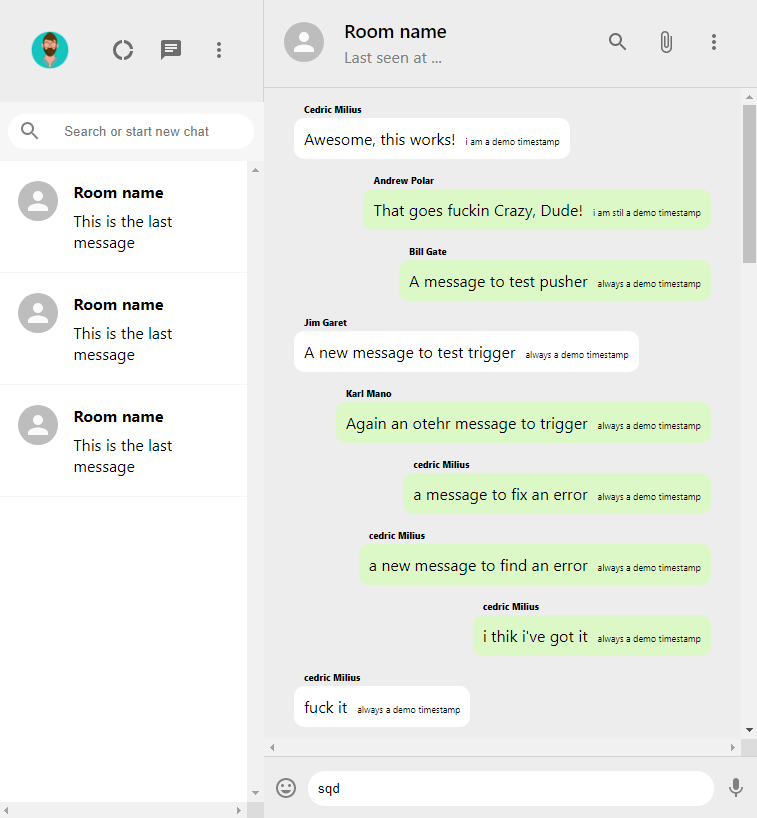

# Tinderdev in progress

application MERN **In progress** using react mongodb express and nodejs.

I've used firebase for authentication and hosting the frontend. I used Herohu to host the backend. Finally I've used MongoDB and Mongose for database and I 've used pusher for realtime message. Pusher Channels provides realtime communication between servers, apps and devices. Channels is used for realtime charts, realtime user lists, realtime maps, multiplayer gaming, and many other kinds of UI updates.

### You can find a DEMO of the application [here](https://whatsapp-client-1872a.web.app/) or clic on the image below.

